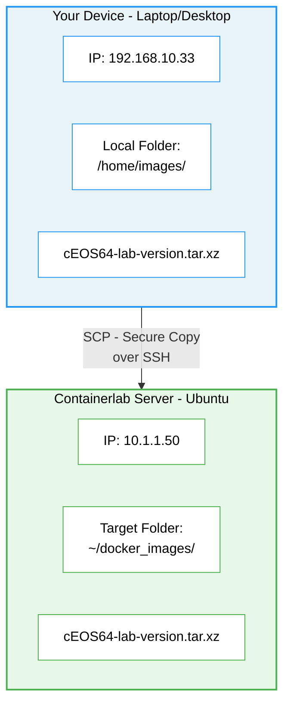

# EIA Container Lab Quick Start - Installation

Containerlab is a free, open-source command-line tool for quickly building network labs using Docker containers.

Instead of spinning up heavy virtual machines, Containerlab runs network operating systems (like Arista cEOS) inside lightweight Docker containers. You define your lab topology in a simple YAML text file, and Containerlab does the rest — creating the nodes and wiring them together.

**Why Containerlab?**

- Labs boot in seconds and use far less RAM and CPU than traditional virtual labs
- Topologies are plain text YAML files — easy to share, version control with Git, and reproduce
- Integrates well with automation tools like Ansible and CI/CD pipelines

**How is it different from CML, EVE-NG, or GNS3?**

Those platforms rely on full virtual machines and typically have graphical interfaces. They work well but are resource-intensive and slower to spin up. Containerlab takes a container-first approach, which makes it much faster and lighter — at the trade-off of only supporting container-based network OS images (not full VM images).

> [!TIP]
>
> Some basic Linux knowledge is helpful for this guide and for network automation in general. See the [Handy Linux Commands](#handy-linux-commands) section at the bottom of this document for a quick reference.

---

## Table of Contents

- [Prerequisites](#prerequisites)
- [Step 1 — Install Docker](#step-1--install-docker)
- [Step 2 — Verify Docker is Working](#step-2--verify-docker-is-working)
- [Step 3 — (Optional) Run Docker Without sudo](#step-3--optional-run-docker-without-sudo)
- [Step 4 — Install Containerlab](#step-4--install-containerlab)
- [Step 5 — Get the cEOS Image onto Your Server](#step-5--get-the-ceos-image-onto-your-server)
- [Step 6 — Import the cEOS Image into Docker](#step-6--import-the-ceos-image-into-docker)
- [Command Line Editor](#command-line-editor)
- [Handy Linux Commands](#handy-linux-commands)

---

## Prerequisites

- An Ubuntu/Debian Linux server (a virtual machine is fine)
- Internet access on the server (to download packages)
- A user account with `sudo` (administrator) privileges

> [!NOTE]
>
> This guide is written for Ubuntu/Debian Linux. Commands may differ on other distributions.
>
> You can run Containerlab on Windows using WSL, but a dedicated Linux VM is recommended for the best experience.
> See: [Containerlab on Windows](https://containerlab.dev/windows/)

---

## Step 1 — Install Docker

Docker is the container engine that Containerlab uses under the hood. Think of Docker as the "hypervisor" for containers — it manages the lightweight virtual environments that your network nodes will run inside.

### 1a. Update your system packages

This ensures you have the latest security patches and package lists before installing anything new.

```bash
sudo apt update && sudo apt upgrade -y
```

### 1b. Install prerequisite packages

These are helper tools that allow your system to securely download and install Docker.

```bash
sudo apt install -y apt-transport-https ca-certificates curl software-properties-common
```

### 1c. Install networking utilities

These provide basic networking commands (`ip`, `ping`) you'll use to interact with your lab.

```bash
sudo apt install -y iproute2 iputils-ping
```

### 1d. Remove any old Docker versions

If you have older or conflicting Docker packages installed, this removes them cleanly so they don't interfere with the new installation.

```bash
for pkg in docker.io docker-doc docker-compose podman-docker containerd runc; do sudo apt-get remove $pkg; done
```

> [!NOTE]
>
> It's normal to see "Package not found" messages here — it just means those packages weren't installed.

### 1e. Add Docker's official repository

This adds Docker's GPG signing key (used to verify downloads are authentic) and registers Docker's package repository so `apt` knows where to find the Docker software.

Run this entire block as one command (copy and paste the whole thing):

```bash
# Add Docker's official GPG key
sudo apt-get update
sudo apt-get install ca-certificates curl
sudo install -m 0755 -d /etc/apt/keyrings
sudo curl -fsSL https://download.docker.com/linux/ubuntu/gpg -o /etc/apt/keyrings/docker.asc
sudo chmod a+r /etc/apt/keyrings/docker.asc

# Add the Docker repository to your system's package sources
echo \
  "deb [arch=$(dpkg --print-architecture) signed-by=/etc/apt/keyrings/docker.asc] https://download.docker.com/linux/ubuntu \
  $(. /etc/os-release && echo "${UBUNTU_CODENAME:-$VERSION_CODENAME}") stable" | \
  sudo tee /etc/apt/sources.list.d/docker.list > /dev/null
```

### 1f. Update package lists again

Now that Docker's repository is added, refresh the package list so your system sees the new Docker packages.

```bash
sudo apt-get update
```

### 1g. Install Docker

This installs the Docker engine and its companion tools.

```bash
sudo apt-get install -y docker-ce docker-ce-cli containerd.io docker-buildx-plugin docker-compose-plugin
```

---

## Step 2 — Verify Docker is Working

### Check that Docker is running

```bash
sudo systemctl status docker
```

You should see `active (running)` in the output. If Docker is not running, start it manually:

```bash
sudo systemctl start docker
```

### Run the Docker test image

This downloads and runs a tiny test container to confirm everything is working.

```bash
sudo docker run hello-world
```

**What to look for:** You should see a message that starts with "Hello from Docker!" — this confirms Docker is installed and working correctly.

> [!TIP]
>
> If you get a "permission denied" error, make sure you're using `sudo` before the `docker` command, or follow Step 3 below.

---

## Step 3 — (Optional) Run Docker Without sudo

By default, Docker commands require `sudo`. You can add your user to the `docker` group so you can run Docker commands without typing `sudo` every time.

See the official guide: [Manage Docker as a non-root user](https://docs.docker.com/engine/install/linux-postinstall/#manage-docker-as-a-non-root-user)

After making this change, refresh your shell for it to take effect:

```bash
source ~/.bashrc
```

---

## Step 4 — Install Containerlab

The easiest way to install Containerlab is with their one-line setup script. This installs Containerlab and any remaining dependencies.

```bash
curl -sL https://containerlab.dev/setup | sudo -E bash -s "all"
```

> [!NOTE]
>
> This script has been tested on Ubuntu 20.04, 22.04, 23.10, and 24.04.

For more details, see the official docs:

- [Containerlab Install Guide](https://containerlab.dev/install)
- [Containerlab Quickstart](https://containerlab.dev/quickstart/)

---

## Step 5 — Get the cEOS Image onto Your Server

Before you can run Arista switches in Containerlab, you need to download the cEOS Docker image from Arista's website and transfer it to your Ubuntu server.

### 5a. Download the cEOS image from Arista

1. Go to [arista.com](https://www.arista.com) and log in (or create a free account — you'll need a business email address).
2. Navigate to **Software Downloads** > **cEOS-lab**.
3. Download the file — it will be named something like `cEOS64-lab-<version>.tar.xz`.
4. Save it to a known location on your laptop/desktop (for example, `/home/images/` on a Mac or `C:\Users\YourName\Downloads\` on Windows).

### 5b. Transfer the image to your Ubuntu server

You need to copy the downloaded image file from your local computer to your Ubuntu server. The diagram below shows what we're doing:



First, log into your Ubuntu server and create a folder to hold your Docker images:

```bash
mkdir -p ~/docker_images
```

Then, **from your local machine** (not the server), use one of the commands below to copy the file.

#### From Mac or Linux

Open a **Terminal** on your Mac/Linux machine and run:

```bash
scp /home/images/cEOS64-lab-<version>.tar.xz  your_username@10.1.1.50:~/docker_images/
```

**Breaking down this command:**

| Part | Meaning |
|:-----|:--------|
| `scp` | Secure Copy — copies files over an encrypted SSH connection |
| `/home/images/cEOS64-lab-<version>.tar.xz` | The path to the file on YOUR computer |
| `your_username@10.1.1.50` | Your login name on the Ubuntu server and its IP address |
| `:~/docker_images/` | The destination folder on the server (`~` means your home directory) |

You'll be prompted for your password on the Ubuntu server. Type it and press Enter (the password won't be visible as you type — this is normal).

> [!TIP]
>
> **Is scp already on my Mac/Linux?** Yes — `scp` comes pre-installed on macOS and virtually all Linux distributions as part of OpenSSH. To quickly verify, open a terminal and run:
> ```bash
> which scp
> ```
> You should see a path like `/usr/bin/scp`. If you do, you're good to go.

#### From Windows

Open **PowerShell** or **Command Prompt** and run:

```powershell
scp C:\Users\YourName\Downloads\cEOS64-lab-<version>.tar.xz  your_username@10.1.1.50:~/docker_images/
```

> [!TIP]
>
> **Is scp already on my Windows PC?** Yes — `scp` is built into Windows 10 (version 1809+) and later as part of the OpenSSH client. To verify, open PowerShell and run:
> ```powershell
> where.exe scp
> ```
> You should see `C:\Windows\System32\OpenSSH\scp.exe`. If you get an error, you can install the OpenSSH client from **Settings > Apps > Optional Features > Add a feature > OpenSSH Client**, or use [WinSCP](https://winscp.net/) — a free graphical tool that lets you drag and drop files to your server.

> [!TIP]
>
> Replace `<version>` with the actual version number in the filename you downloaded (e.g., `4.33.0F`), `your_username` with your actual login name on the Ubuntu server, and adjust the source path to wherever you saved the file.

---

## Step 6 — Import the cEOS Image into Docker

Now that the image file is on your Ubuntu server, you need to import it into Docker so Containerlab can use it.

### Import the image with a version tag

On your **Ubuntu server**, run:

```bash
cd ~/docker_images
docker import cEOS64-lab-<version>.tar.xz ceos:<version>
```

For example, if your file is `cEOS64-lab-4.33.0F.tar.xz`:

```bash
docker import cEOS64-lab-4.33.0F.tar.xz ceos:4.33.0F
```

### Also tag it as "latest"

This makes it easier to reference in your Containerlab topology files — you can just use `ceos:latest` instead of remembering the exact version number.

```bash
docker import cEOS64-lab-<version>.tar.xz ceos:latest
```

### Verify the image was imported

```bash
docker images | grep ceos
```

You should see your image listed with both the version tag and the `latest` tag.

---

## Command Line Editor

You'll occasionally need to edit text files on your Linux server (for example, Containerlab topology YAML files). The `vi` editor is available on virtually every Linux system.

If you're new to `vi`, it can feel unintuitive at first — here's a quick tutorial to get started:
[Learn vi/vim](https://vimschool.netlify.app/introduction/vimtutor/)

> [!TIP]
>
> If `vi` feels overwhelming, you can install `nano` — a simpler editor:
> ```bash
> sudo apt install -y nano
> ```
> Then use `nano filename.yaml` to edit files. It shows keyboard shortcuts at the bottom of the screen.

---

## Handy Linux Commands

A quick reference for common commands you'll use when working with Containerlab and Linux.

| Command | What It Does | Example |
|:--------|:-------------|:--------|
| `ls` | Lists files in the current directory | `ls -la` — show all files with details |
| `cd` | Changes directory | `cd ~/docker_images` — go to the docker_images folder |
| `mkdir` | Creates a new folder | `mkdir my_labs` — create a folder named *my_labs* |
| `pwd` | Shows your current location in the file system | `pwd` — prints the full path |
| `cp` | Copies a file | `cp file.txt backup/file.txt` |
| `mv` | Moves or renames a file | `mv old.txt new.txt` |
| `rm` | Deletes a file (**use carefully!**) | `rm -r old_project` — deletes a folder and its contents |
| `sudo` | Runs a command as administrator | `sudo apt update` |
| `curl` | Downloads from a URL | `curl -O https://example.com/file.zip` |
| `ip address` | Shows your network interfaces and IP addresses | `ip address show` |
| `df` | Shows disk space usage | `df -h` — human-readable sizes |
| `du` | Shows folder sizes | `du -h --max-depth=1 /home` |
| `cat` | Displays the contents of a file | `cat config.yaml` |
| `less` | Views a file one screen at a time (press `q` to quit) | `less /var/log/syslog` |
| `vi` | Opens the vi text editor | `vi topology.yaml` |
| `top` | Shows running processes and resource usage | `top` — press `q` to quit |
| `uname` | Shows system information | `uname -a` — all system info |
| `who` | Shows who is logged in | `who` |
