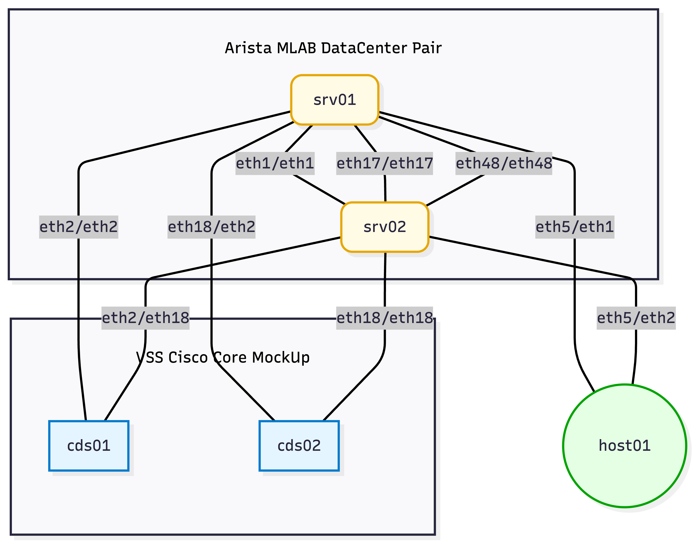

# EIA Container Lab Quick Start - Campus Data Center Topology


> [!TIP]
>
> Having some basic Linux training is helpful for this and for automation in general.  See the [Handy Linux Commands](#handy-linux-commands) section at the bottom of this document.


[TOC]


## Installation Guides

Containerlab is a lightweight, open-source CLI tool for rapidly deploying network labs using Docker (or Podman).

It defines topologies in simple YAML files, enabling quick spin-up of single or multi-vendor environments for testing automation and features.  Because the labs are in YAML text files, they can easily be shared and put under revision control so a team can work off the same topology.

## Key Differences from other Virtual Lab Environments

Unlike VM-heavy platforms like CML (Cisco-focused, resource-intensive simulations) or EVE-NG/GNS3 (GUI-driven, broader VM support but slower), Containerlab emphasizes container-native NOS for extreme efficiency. Lab topologies boot in seconds, use far less RAM/CPU, and integrate natively with Git, Ansible, and CI/CD pipelines.

> [!IMPORTANT]
>
> Start here for setup
>
> [ContainerLab_Setup](CLAB_SETUP.md)


## Campus Arista Data Center Switches

`campus_dc_sw_arista.clab.yml`

> [!NOTE]
>
> **Why `.clab.yml`?** Containerlab automatically discovers topology files that use the `.clab.yml` (or `.clab.yaml`) extension. If your file follows this naming convention, you can simply run `clab deploy` from the directory without specifying a file with the `-t` flag. This is a Containerlab best practice.

> [!TIP]
>
> **You don't need `sudo` with `clab`.** If you added your user to the `docker` group during setup (with `sudo usermod -aG docker $USER`), you can run all `clab` commands without `sudo`. Just make sure you logged out and back in after adding yourself to the group. You can verify with `groups` — if you see `docker` in the output, you're all set. The examples in this guide omit `sudo` for brevity, but if you skipped the docker-group step, prepend `sudo` to each `clab` command.

Topology



This topology models a traditional MultiChassis Etherchannel (MCEC) Core and Data Center switches network and includes one "user device" so we can understand the "user" end of things.

> [!TIP]
>
> **Key terms for beginners:**
> - **cEOS** (containerized EOS) — A Docker container version of Arista's EOS (Extensible Operating System) network operating system. It behaves like a real Arista switch but runs as a lightweight container.
> - **SVI** (Switched Virtual Interface) — A virtual Layer 3 interface on a VLAN that acts as the default gateway for devices on that VLAN.
> - **VLAN** (Virtual LAN) — A logical grouping of switch ports into separate broadcast domains, allowing network segmentation without additional physical switches.
> - **Access port** — A switch port that belongs to a single VLAN and connects to end devices (like a desktop or server).
> - **Trunk port** — A switch port that carries traffic for multiple VLANs between switches.
> - **Layer 2 (L2)** — Switching; forwarding frames based on MAC addresses within a VLAN.
> - **Layer 3 (L3)** — Routing; forwarding packets based on IP addresses between subnets.

We will use this lab to
1. review the work needed to provision a new subnet/vlan and
2. to review the steps needed to move a user device to a different subnet/vlan.

### Getting the lab to your Virtual Machine

Using the git clone command:
`git clone https://github.com/eianow-automation/campus_dc_switches_arista.git`

will create a new directory with the repository name and place the contents of the repository in that directory.


```bash
claudia@ubuntu:~/containerlabs$ git clone https://github.com/eianow-automation/campus_dc_switches_arista.git
Cloning into 'campus_dc_switches_arista'...
```

Once you have cloned the lab repository, move into the new directory and deploy the lab.

```bash
claudia@ubuntu:~/containerlabs$ cd campus_dc_switches_arista/
claudia@ubuntu:~/containerlabs/campus_dc_switches_arista$ ls
README.md  campus_dc_sw_arista.clab.yml  images/  na-us-0000-test-as01.cfg  na-us-0000-test-as02.cfg  na-us-0000-test-as03.cfg  na-us-0000-test-cs01.cfg  na-us-0000-test-ds01.cfg
```

Deploy the lab using the topology file:

`clab deploy -t campus_dc_sw_arista.clab.yml`

```bash
claudia@ubuntu:~/containerlabs/campus_dc_switches_arista$ clab deploy -t campus_dc_sw_arista.clab.yml
INFO[0000] Containerlab v0.56.0 started
INFO[0000] Parsing & checking topology file: campus_dc_sw_arista.clab.yml
INFO[0000] Creating docker network: Name="clab", IPv4Subnet="172.20.20.0/24", IPv6Subnet="2001:172:20:20::/64", MTU=1500
INFO[0000] Creating lab directory: /home/claudia/containerlabs/campus_dc_switches_arista/clab-cds-seg
INFO[0000] Creating container: "na-us-0000-test-as02"
INFO[0000] Creating container: "na-us-0000-test-cs01"
INFO[0000] Creating container: "na-us-0000-test-ds01"
INFO[0000] Creating container: "na-us-0000-test-as01"
INFO[0000] Creating container: "na-us-0000-test-as03"
INFO[0002] Creating container: "desktop"
INFO[0004] Created link: na-us-0000-test-cs01:eth1 <--> na-us-0000-test-ds01:eth1
INFO[0004] Created link: na-us-0000-test-cs01:eth2 <--> na-us-0000-test-ds01:eth2
INFO[0004] Running postdeploy actions for Arista cEOS 'na-us-0000-test-as02' node
INFO[0005] Created link: na-us-0000-test-cs01:eth3 <--> na-us-0000-test-ds01:eth3
INFO[0005] Created link: na-us-0000-test-ds01:eth5 <--> na-us-0000-test-as01:eth1
INFO[0005] Created link: na-us-0000-test-cs01:eth4 <--> na-us-0000-test-ds01:eth4
INFO[0005] Running postdeploy actions for Arista cEOS 'na-us-0000-test-cs01' node
INFO[0005] Created link: desktop:eth1 <--> na-us-0000-test-as01:eth3
INFO[0005] Created link: na-us-0000-test-ds01:eth6 <--> na-us-0000-test-as01:eth2
INFO[0006] Created link: na-us-0000-test-ds01:eth7 <--> na-us-0000-test-as02:eth1
INFO[0006] Created link: na-us-0000-test-ds01:eth8 <--> na-us-0000-test-as02:eth2
INFO[0007] Created link: na-us-0000-test-ds01:eth9 <--> na-us-0000-test-as03:eth1
INFO[0007] Created link: na-us-0000-test-ds01:eth10 <--> na-us-0000-test-as03:eth2
INFO[0007] Running postdeploy actions for Arista cEOS 'na-us-0000-test-ds01' node
INFO[0007] Running postdeploy actions for Arista cEOS 'na-us-0000-test-as01' node
INFO[0007] Running postdeploy actions for Arista cEOS 'na-us-0000-test-as03' node
INFO[0075] Adding containerlab host entries to /etc/hosts file
INFO[0075] Adding ssh config for containerlab nodes
+---+-----------------------------------+--------------+---------------+-------+---------+-----------------+----------------------+
| # |               Name                | Container ID |     Image     | Kind  |  State  |  IPv4 Address   |     IPv6 Address     |
+---+-----------------------------------+--------------+---------------+-------+---------+-----------------+----------------------+
| 1 | clab-cds-seg-desktop              | c08bb91c8423 | ubuntu:latest | linux | running | 172.20.20.2/24  | 2001:172:20:20::7/64 |
| 2 | clab-cds-seg-na-us-0000-test-as01 | 92a4f5d3cdcf | ceos:4.32.1F  | ceos  | running | 172.20.20.31/24 | 2001:172:20:20::3/64 |
| 3 | clab-cds-seg-na-us-0000-test-as02 | 551c47850120 | ceos:4.32.1F  | ceos  | running | 172.20.20.32/24 | 2001:172:20:20::2/64 |
| 4 | clab-cds-seg-na-us-0000-test-as03 | 96c4473726fe | ceos:4.32.1F  | ceos  | running | 172.20.20.33/24 | 2001:172:20:20::5/64 |
| 5 | clab-cds-seg-na-us-0000-test-cs01 | 959123e6f3fa | ceos:4.32.1F  | ceos  | running | 172.20.20.10/24 | 2001:172:20:20::4/64 |
| 6 | clab-cds-seg-na-us-0000-test-ds01 | 1070af10995b | ceos:4.32.1F  | ceos  | running | 172.20.20.20/24 | 2001:172:20:20::6/64 |
+---+-----------------------------------+--------------+---------------+-------+---------+-----------------+----------------------+
```

> [!NOTE]
>
> **Management network vs. lab data-plane:** The 172.20.20.0/24 addresses shown above are the **management network** that Containerlab creates automatically. This is an out-of-band Docker network used to SSH into your nodes or access them via `docker exec`. It is completely separate from the lab's data-plane subnets (like 192.168.100.0/24) that you will configure in the exercises.

### Topology


How to read the topology file:

First, a default image of Arista ceos:4.32.1F is defined.
If a node section does not specify an image then that Arista image will be used to spin up that device.

In addition to the 5 Arista EOS switches, the lab includes one "desktop" node which will use
the ubuntu:latest image (a plain Linux container that simulates an end-user workstation).

```yaml
name: cds-seg

topology:
  defaults:
    kind: ceos
    image: ceos:4.32.1F
  nodes:
    desktop:
      kind: linux
      image: ubuntu:latest
      cmd: sleep infinity
    na-us-0000-test-cs01:
      kind: ceos
      mgmt-ipv4: 172.20.20.10
      startup-config: ./na-us-0000-test-cs01.cfg
    na-us-0000-test-ds01:
      kind: ceos
      mgmt-ipv4: 172.20.20.20
      startup-config: ./na-us-0000-test-ds01.cfg
    na-us-0000-test-as01:
      kind: ceos
      mgmt-ipv4: 172.20.20.31
      startup-config: ./na-us-0000-test-as01.cfg
    na-us-0000-test-as02:
      kind: ceos
      mgmt-ipv4: 172.20.20.32
      startup-config: ./na-us-0000-test-as02.cfg
    na-us-0000-test-as03:
      kind: ceos
      mgmt-ipv4: 172.20.20.33
      startup-config: ./na-us-0000-test-as03.cfg

  links:
    - endpoints: ["na-us-0000-test-cs01:eth1", "na-us-0000-test-ds01:eth1"]
    - endpoints: ["na-us-0000-test-cs01:eth2", "na-us-0000-test-ds01:eth2"]
    - endpoints: ["na-us-0000-test-cs01:eth3", "na-us-0000-test-ds01:eth3"]
    - endpoints: ["na-us-0000-test-cs01:eth4", "na-us-0000-test-ds01:eth4"]
    - endpoints: ["na-us-0000-test-ds01:eth5", "na-us-0000-test-as01:eth1"]
    - endpoints: ["na-us-0000-test-ds01:eth6", "na-us-0000-test-as01:eth2"]
    - endpoints: ["na-us-0000-test-ds01:eth7", "na-us-0000-test-as02:eth1"]
    - endpoints: ["na-us-0000-test-ds01:eth8", "na-us-0000-test-as02:eth2"]
    - endpoints: ["na-us-0000-test-ds01:eth9", "na-us-0000-test-as03:eth1"]
    - endpoints: ["na-us-0000-test-ds01:eth10", "na-us-0000-test-as03:eth2"]
    - endpoints: ["desktop:eth1", "na-us-0000-test-as01:eth3"]


    - type: dummy
      endpoint:
        node: na-us-0000-test-as01
        interface: eth4
... <snip>
```


#### Credentials

| Node Type | Username | Password | How to Access |
| :-------- | :------- | :------- | :------------ |
| cEOS switches | admin | admin | `ssh admin@clab-cds-seg-<switch-name>` or `docker exec -it clab-cds-seg-<switch-name> Cli` |
| Ubuntu desktop | root | (none — no password needed) | `docker exec -it clab-cds-seg-desktop bash` |

```bash
claudia@ubuntu:~/containerlabs/campus_dc_switches_arista$ docker exec -it clab-cds-seg-desktop bash
root@desktop:/# # You are now in the Ubuntu container
root@desktop:/# apt update

```

```bash
# You will be logged in as root so you don't need sudo to elevate your privileges
apt update
apt install -y iproute2 iputils-ping

ip addr add 192.168.100.33/24 dev eth1
ip link set eth1 up
```


On the switch side, you'll need to configure the corresponding interface.
You can access the switch CLI and configure it as needed:

```bash
# Access the switch CLI directly via Docker
docker exec -it clab-cds-seg-na-us-0000-test-cs01 Cli

# Or SSH into the switch using the management IP
ssh admin@clab-cds-seg-na-us-0000-test-cs01
```

You can verify the lab is running and see all node details with `clab inspect`:

``` bash
claudia@ubuntu:~/containerlabs/campus_dc_switches_arista$ clab inspect
INFO[0000] Parsing & checking topology file: campus_dc_sw_arista.clab.yml
+---+-----------------------------------+--------------+---------------+-------+---------+-----------------+----------------------+
| # |               Name                | Container ID |     Image     | Kind  |  State  |  IPv4 Address   |     IPv6 Address     |
+---+-----------------------------------+--------------+---------------+-------+---------+-----------------+----------------------+
| 1 | clab-cds-seg-desktop              | 2120629b0541 | ubuntu:latest | linux | running | 172.20.20.2/24  | 2001:172:20:20::7/64 |
| 2 | clab-cds-seg-na-us-0000-test-as01 | f8cd269a6877 | ceos:4.32.1F  | ceos  | running | 172.20.20.31/24 | 2001:172:20:20::3/64 |
| 3 | clab-cds-seg-na-us-0000-test-as02 | d34416e9a14f | ceos:4.32.1F  | ceos  | running | 172.20.20.32/24 | 2001:172:20:20::2/64 |
| 4 | clab-cds-seg-na-us-0000-test-as03 | 77408daa8610 | ceos:4.32.1F  | ceos  | running | 172.20.20.33/24 | 2001:172:20:20::4/64 |
| 5 | clab-cds-seg-na-us-0000-test-cs01 | 1c8f30bee2f7 | ceos:4.32.1F  | ceos  | running | 172.20.20.10/24 | 2001:172:20:20::5/64 |
| 6 | clab-cds-seg-na-us-0000-test-ds01 | c460894d8a6d | ceos:4.32.1F  | ceos  | running | 172.20.20.20/24 | 2001:172:20:20::6/64 |
+---+-----------------------------------+--------------+---------------+-------+---------+-----------------+----------------------+
```


# **Exercise 1 - Gateway and L2 down to Users Desktop**

Now that most everyone has their Containerlab topology up and running, lets work on an exercise.

Intranet Data Vlan

​	1.	Create a new Vlan 100 for subnet [192.168.100.0/24](https://192.168.100.0/24) with the gateway on the core

​	2.	Establish layer 2 down through the distribution switch down to as01 on a single link and keeping ds01 at layer 2.

​	3.	Configure as01 Eth3 as an access port on vlan 100.

​	4.	Configure IP [192.168.100.33/24](https://192.168.100.33/24) on the user desktop.

​	5.	Ping the gateway from the desktop and share a screen cap in this thread.

Tip:

The commands below will help you configure the IP address on the desktop.

```bash
# The desktop container runs as root, so you do NOT need sudo

ip addr add 192.168.100.33/24 dev eth1 #you should confirm the interface with `ip add` command

ip link set dev eth1 up   # make sure the interface is "up"

ip add # verify your IP address
```

You may need to install some packages if the ip add command does not work (is not found)

```bash
# Remember, you are root inside the container — no sudo needed
apt update

apt install -y net-tools iproute2
```

Default Gateway
```bash
ip route change default via 192.168.100.1 dev eth1
```

Example session on the desktop container:

```bash
claudia@ubuntu:~/containerlabs/campus_dc_switches_arista$ docker exec -it clab-cds-seg-desktop bash
root@desktop:/# apt update
root@desktop:/# apt install -y iproute2 iputils-ping
root@desktop:/# ip addr add 192.168.100.33/24 dev eth1
root@desktop:/# ip link set eth1 up
root@desktop:/# ip route change default via 192.168.100.1 dev eth1
root@desktop:/# ping 192.168.100.1
```


# **Exercise 2 - Link Aggregation**

**Goal**

Put all links into port channels first without LACP and then for the final configuration using LACP.

​	1.	Place the 4 links between cs and ds into a port channel numbered 10. Arista and other vendors call this LAG (Link Aggregation Groups) but its pretty common to just say port-channel.

​	2.	Place the two links between ds and as01 into a port channel numbered 100

​	3.	Place the two links between ds and as02 into a port channel numbered 200

​	4.	Place the two links between ds and as03 into a port channel numbered 300

https://arista.my.site.com/AristaCommunity/s/article/how-to-configure-link-aggregation-groups-in-eos

**Tip:**

when using LACP, the upstream switch should be the active member.

**Results**

provide the show port-channel output for each port channel configured from each device participating in the port channel. The first set without LACP and the second set with the port channels configured with LACP.

**Extra credit**

Pick a port channel

using LACP, configure both ends in passive mode - what happens?

using LACP, configure both ends in active mode - what happens?

**Tip:**

what should you do with any existing configuration on an interface?? (that is what should you do with the switch interface configurations from Exercise 1?).

**Extra Extra credit.**

Fix your port channel configurations so that you can still ping your desktop from the core and the gateway on the core from the desktop. (think port channel rather than interface)

# **Exercise 3 - Routing**


**Goal**
Configure dynamic routing using OSPF routing between core and distro, Move the 192.168.100.0/24 SVI from core to distro and make sure that the core has a layer 3 or routed path to the desktop.

1. Configure port channel 10 interface as a Layer 3 link (means that rather than having a switchport trunk interface with vlans you will have a routed point to point link on a specific subnet).  Use subnet 192.168.10.0/29.  Use the first available IP for the core and the last valid available IP for the ds.

From the core, ping the 192.168.10 ds Po10 interface IP (save screen shot)
From the distro, ping the 192.168.10 cs Po10 interface IP (save screen shot)

2. Configure loopback0 interfaces:
cs 192.168.0.1/32
ds 192.168.0.2/32

3. Configure OSPF area 10 and advertise the loopbacks.
https://arista.my.site.com/AristaCommunity/s/article/a-simple-ospf-configuration

**Extra credit:** Don't advertise everything.  Be deterministic about every route you are advertising.

4. Move the vlan 100 SVI from the core to the distribution and route the subnet.  The cs should have a routing table which includes subnet 192.168.100.0/24 learned from the distro.

**Tip:**  Make sure routing is enabled on your core and distro

---

please share the following answers and results

**Questions:**

Why are loopbacks a best practice?

What special property do loopback interfaces have?

Why is it a best practice to be specific about which routes to advertise into your routing protocol?

**Results:**
Po10 interface ping screen shots from step 1
Share the routing table on both core and distro.
From the Core, try to ping the desktop 192.168.100.33. share screen shot
From the desktop, try to ping the vlan 100 gateway, the cs loopback and the ds loopback and share screen shots
From the core, trace to the desktop and share screen shot

Some of the above will fail.   Why might that be?

---

> [!NOTE]
>
> **Reference: Sample Docker & Containerlab Installation Session**
>
> The shell history below is included as a reference showing one user's complete installation session (Docker, Containerlab, and cEOS image import). This is not something you need to run step by step — see [CLAB_SETUP.md](CLAB_SETUP.md) for the official setup instructions. This is provided so you can see the general flow of commands involved.

```bash
# 1. Install Docker prerequisites
sudo apt update && sudo apt upgrade -y
sudo apt install -y apt-transport-https ca-certificates curl software-properties-common

# 2. Add Docker GPG key and repository
curl -fsSL https://download.docker.com/linux/ubuntu/gpg | sudo gpg --dearmor -o /usr/share/keyrings/docker-archive-keyring.gpg
echo "deb [arch=$(dpkg --print-architecture) signed-by=/etc/apt/keyrings/docker.asc] https://download.docker.com/linux/ubuntu \
  $(. /etc/os-release && echo "${UBUNTU_CODENAME:-$VERSION_CODENAME}") stable" | sudo tee /etc/apt/sources.list.d/docker.list > /dev/null

# 3. Install Docker Engine
sudo apt-get update
sudo apt-get install docker-ce docker-ce-cli containerd.io docker-buildx-plugin docker-compose-plugin

# 4. Start Docker and add your user to the docker group
sudo systemctl start docker
sudo groupadd docker
sudo usermod -aG docker $USER
# Log out and back in for group membership to take effect

# 5. Verify Docker works
docker run hello-world

# 6. Install Containerlab
curl -sL https://containerlab.dev/setup | sudo -E bash -s "all"

# 7. Import the Arista cEOS image (you must have the .tar file)
docker import cEOS64-lab-4.32.1F.tar ceos:4.32.1F

# 8. Verify images are available
docker images
```


# Handy Linux Commands

| Command      | Description                                                  | Common Usage                                                 | Category                   |
| :----------- | :----------------------------------------------------------- | :----------------------------------------------------------- | :------------------------- |
| `ls`         | Lists files and directories in the current directory.        | `ls -l` – List in long format with details; `ls -al` – List all files including hidden ones in long format | File management            |
| `cd`         | Changes the current working directory to the specified path. | `cd /etc` – Move to the `/etc` directory                     | File management            |
| `mkdir`      | Creates a new directory with the given name.                 | `mkdir projects` – Create a directory named *projects*       | File management            |
| `pwd`        | Prints the current working directory path.                   | `pwd` – Output current path                                  | File management            |
| `cp`         | Copies files or directories.                                 | `cp file1.txt backup/file1.txt` – Copy *file1.txt* to *backup/* | File management            |
| `mv`         | Moves or renames files and directories.                      | `mv oldname.txt newname.txt` – Rename a file                 | File management            |
| `rm`         | Removes (deletes) files or directories. Use with caution.    | `rm -r old_project` – Delete *old_project* directory and its contents | File management            |
| `sudo`       | Executes a command with elevated (superuser) privileges. Requires appropriate permissions. | `sudo apt update` – Run package update as administrator      | System administration      |
| `curl`       | Transfers data to or from a server using various protocols (HTTP, HTTPS, FTP, etc.). Requires `curl` package to be installed. | `curl -O https://example.com/file.zip` – Download a file     | Networking / Data transfer |
| `ip address` | Displays or manages IP addresses and network interfaces. Part of the `iproute2` package, which must be installed. | `ip address show` – Display network interface details        | Networking                 |
| `df`         | Shows disk space usage for mounted filesystems in human-readable form (GB/MB). | `df -h` – View free and used space on all drives             | System monitoring          |
| `du`         | Shows disk usage per directory in human-readable units (GB/MB). | `du -h --max-depth=1 /home` – Show space by directory in `/home` | System monitoring          |
| `cat`        | Displays the contents of a file on the terminal.             | `cat file.txt` – Print the contents of *file.txt*            | File viewing               |
| `less`       | Views file contents one screen at a time with navigation commands. | `less /var/log/syslog` – Page through system logs            | File viewing               |
| `vi`         | Opens the *vi* text editor for viewing or editing files. Installed by default on most Unix systems. | `vi config.txt` – Open *config.txt* in *vi* editor           | File editing               |
| `top`        | Displays real-time information about running processes and resource usage. | `top` – Monitor CPU and memory usage interactively           | System information         |
| `uname`      | Shows system information such as kernel version, hostname, and architecture. | `uname -a` – Display all available system info               | System information         |
| `who`        | Lists users currently logged into the system.                | `who` – See active login sessions                            | System information         |


# Containerlab Handy Commands Reference

[Clab handy commands](containerlab-handy-commands.md)
